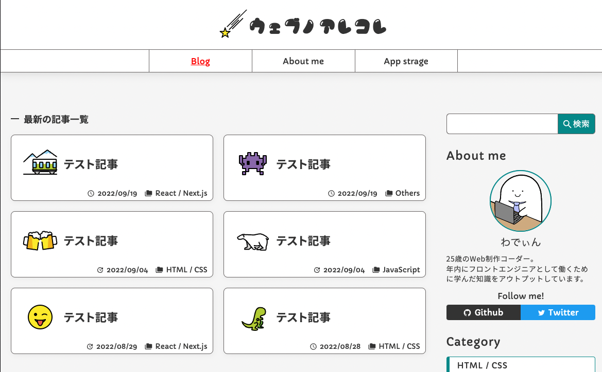

# Next.js × microCMS で JAMStack ブログ制作 🦖

## 使用技術

|    使用技術     | バージョン  |
| :-------------: | :---------: |
|      react      |   18.2.0    |
|      next       |   12.2.5    |
|   typescript    |    4.7.4    |
|     emotion     |   11.10.0   |
|      axios      |   0.27.2    |
| microcms-js-sdk |    2.2.1    |
|     recoil      |    0.7.5    |
|     eslint      |   8.23.0    |
|    prettier     |    2.7.1    |
|       mui       |   5.10.2    |
|      uuid       |    8.3.2    |
|    firebase     |    9.9.4    |
|  highlight.js   |   11.6.0    |
|     cheerio     | 1.0.0-rc.12 |
|      dayjs      |   1.11.5    |
|       swr       |    1.3.0    |
|    base64url    |    3.0.1    |
<br />

## 機能

- ### ブログ機能

  - 記事一覧ぺージ
  - カテゴリ別記事一覧ぺージ
  - 記事検索フォーム
  - 画面プレビュー(vercel と連動) \*準備中
  - Google Analytics \*準備中
  - 人気記事 \*準備中
  - 記事詳細ページ
  - コメント機能(Firestore)
  - OGP 自動生成機能
  - 目次機能

- ### その他
  - プロフィールページ
  - アプリ倉庫(Json でデータ保管)
<br />

## バージョン管理

| バージョン | リリース日 |               リリース内容                |
| :--------: | :--------: | :---------------------------------------: |
|   1.0.0    | 2022.09.06 | ブログ一覧・詳細ページ/プロフィールページ |
|   1.1.0    | 2022.09.19 | OGP 自動生成/App 倉庫ページ/コメント機能  |
<br />

## microCMS API スキーマ

|     ID      |        表示名        |             種類             | 必須 |
| :---------: | :------------------: | :--------------------------: | :--: |
|    title    |       タイトル       |      テキストフィールド      |  ◯   |
|    date     |       作成日時       |             日時             |  ◯   |
|   update    |       更新日時       |             日時             |  ×   |
| toc_visible |         目次         |            真偽値            |  ×   |
|  eyecatch   | アイキャッチ(絵文字) |             画像             |  ◯   |
|  category   |       カテゴリ       | 繰り返し(2 件)のフィールド\*1 |  ◯   |
|   content   |         内容         |        リッチエディタ        |  ◯   |
| description |  ディスクリプション  |        テキストエリア        |  ×   |

<br />

\*1: カスタムフィールド
| ID | 表示名 | 種類 | 必須 |
| :---------: | :------------------: | :------------------------: | :--: |
| richEditor | リッチエディタ | リッチエディタ | × |
| html | HTML | テキストエリア | × |
<br />

## Cloud Firestore DB

<table>
<tr align="center">
<th>データモデル</th>
<th>データ名</th>
<th>タイプ</th>
</tr>
<tr>
<tr align="center">
<th>collection</th>
<td>投稿記事ID</td>
<td>-</td>
</tr>
<tr align="center">
<th>document</th>
<td>自動ID</td>
<td>-</td>
</tr>
<tr align="center">
<th rowspan="3">data</th>
<td>date</td>
<td>timestamp</td>
</tr>
<tr  align="center">
<td>name</td>
<td>string</td>
</tr>
<tr align="center">
<td>text</td>
<td>string</td>
</tr>
</table>
<br />

## 環境変数

```
# microCMS
NEXT_PUBLIC_MICROCMS_ACCESS_KEY={your-serviceDomain}
NEXT_PUBLIC_MICROCMS_API_KEY={your-apiKey}
NEXT_PUBLIC_MICROCMS_OGP_ARTICLE={microCMS-strage} *自動生成(記事ページ)
NEXT_PUBLIC_MICROCMS_OGP_BASE={microCMS-strage} *ブログ以外のOGP画像
# Firebase
NEXT_PUBLIC_FIREBASE_API_KEY={your-apiKey}
NEXT_PUBLIC_FIREBASE_AUTH_DOMAIN={your-authDomain}
NEXT_PUBLIC_FIREBASE_PROJECT_ID={your-projectId}
NEXT_PUBLIC_FIREBASE_STORAGE_BUCKET={your-storageBucket}
NEXT_PUBLIC_FIREBASE_MESSAGING_SENDER_ID={your-messagingSenderId}
NEXT_PUBLIC_FIREBASE_APP_ID={your-appId}
NEXT_PUBLIC_FIREBASE_MEASUREMENT_ID={your-measurementId}

# Hosting
NEXT_PUBLIC_HOST={your-url}
```

**アプリイメージ 🙌**


## 作業期間

12 日程度

## 開発者

[わでぃん](https://github.com/wadeen)

## 公開 URL

https://wadeen.net/
