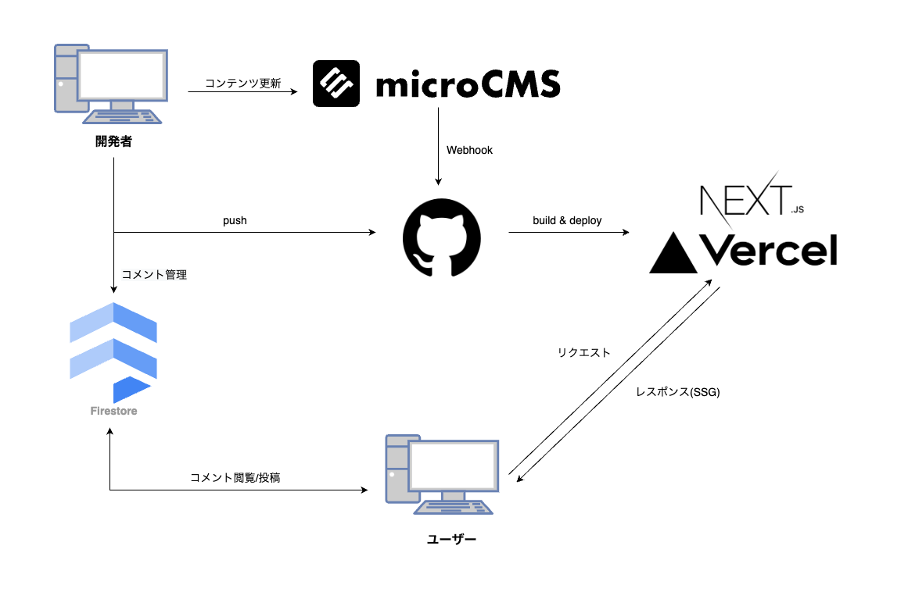

# Next.js × microCMS で JAMStack ブログ制作 🦖

## アーキテクチャ図


<br />

## 機能

- ### ブログ機能

  - 記事一覧ぺージ
  - カテゴリ別記事一覧ぺージ
  - 記事検索フォーム
  - 画面プレビュー(vercel と連動)
  <!-- - Google Analytics \*準備中
  - 人気記事 \*準備中 -->
  - 記事詳細ページ
  - コメント機能(Firestore)
  - OGP 自動生成機能
  - 目次機能

- ### プロフィールページ

- ### アプリ倉庫
    <br />

**アプリイメージ 🙌**


## microCMS API スキーマ

3 つの API スキーマを使用しています。

### ① ブログ：posts

|     ID      |        表示名        |               種類                | 必須 |
| :---------: | :------------------: | :-------------------------------: | :--: |
|    title    |       タイトル       |        テキストフィールド         |  ◯   |
| created_at  |       作成日時       |               日時                |  ◯   |
| updated_at  |       更新日時       |               日時                |  ×   |
| toc_visible |         目次         |              真偽値               |  ×   |
|  eyecatch   | アイキャッチ(絵文字) |               画像                |  ◯   |
|  category   |       カテゴリ       | 繰り返し(2 件)のフィールド\*1 \*2 |  ◯   |
|   content   |         内容         |          リッチエディタ           |  ◯   |
| description |  ディスクリプション  |          テキストエリア           |  ×   |

<br />

\*1: カスタムフィールド:リッチエディタ(richEditor)
| ID | 表示名 | 種類 | 必須 |
| :---------: | :------------------: | :------------------------: | :--: |
| richEditor | リッチエディタ | リッチエディタ | × |

\*2: カスタムフィールド:html(HTML)
| ID | 表示名 | 種類 | 必須 |
| :---------: | :------------------: | :------------------------: | :--: |
| html | HTML | テキストエリア | × |

<br />

### ② カテゴリ：categories

|  ID  |   表示名   |        種類        | 必須 |
| :--: | :--------: | :----------------: | :--: |
| name | カテゴリ名 | テキストフィールド |  ×   |

<br />

### ③ アプリ倉庫：storage

|   ID    |   表示名   |             種類              | 必須 |
| :-----: | :--------: | :---------------------------: | :--: |
|   img   | サムネイル |             画像              |  ◯   |
|  title  |  タイトル  |      テキストフィールド       |  ◯   |
|  tags   |    タグ    | 繰り返し(2 件)のフィールド\*3 |  ×   |
| message |  ひとこと  |      テキストフィールド       |  ×   |
| github  |   github   |      テキストフィールド       |  ×   |
| website |  カテゴリ  |          サイト URL           |  ◯   |

\*3: カスタムフィールド：タグ(tags)
| ID | 表示名 | 種類 | 必須 |
| :---------: | :------------------: | :------------------------: | :--: |
| tag | タグ | テキストフィールド | × |

<br />

## Cloud Firestore DB

<table>
<tr align="center">
<th>データモデル</th>
<th>データ名</th>
<th>タイプ</th>
</tr>
<tr>
<tr align="center">
<th>collection</th>
<td>投稿記事ID</td>
<td>-</td>
</tr>
<tr align="center">
<th>document</th>
<td>自動ID</td>
<td>-</td>
</tr>
<tr align="center">
<th rowspan="3">data</th>
<td>date</td>
<td>timestamp</td>
</tr>
<tr  align="center">
<td>name</td>
<td>string</td>
</tr>
<tr align="center">
<td>text</td>
<td>string</td>
</tr>
</table>
<br />

## 環境構築

```
# clone してディレクトリ移動
git clone https://github.com/wadeen/nextjs-blog.git

# nextjs-blog に移動
cd nextjs-blog

# パッケージのインストール
npm install

# FirebaseコンソールからFirebaseアプリを作成

# microCMS管理画面から新規サービスを作成

# "環境変数" を.envファイルに適宜貼り付け

```

## 開発者

[わでぃん](https://github.com/wadeen)

## 公開 URL

https://wadeen.net/
